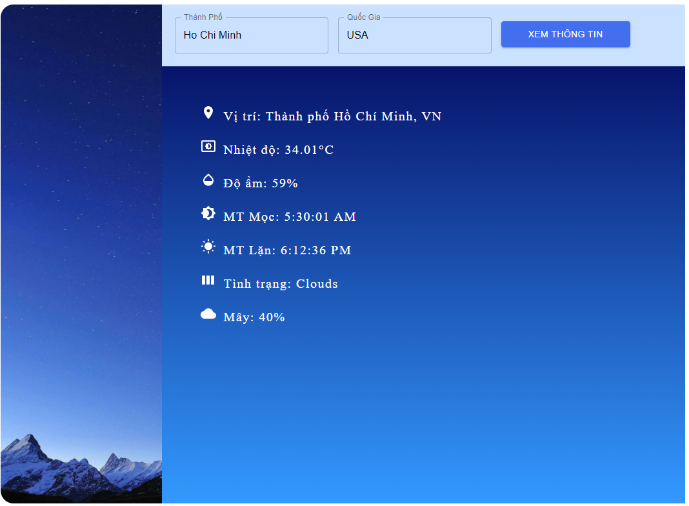

<h1>Weather React </h1>  

This is a React.js learning project for practice ES6, Redux and how to fetch data from public API <a href="https://openweathermap.org/">Open Weather Map</a>.

 

<h1> Screen </h1>  

   
 <h1> Implementation </h1>
 
 I used these react libraries for the project:
 <ul>
  <li> Material-UI</li>
  <li> Axios</li>
  <li> React</li>
</ul>  

You can run the project running the command 

### `npm start`

<h1> What i learned ? </h1>

I learned how to use some React Patterns like High-Order Component and presentational components 

